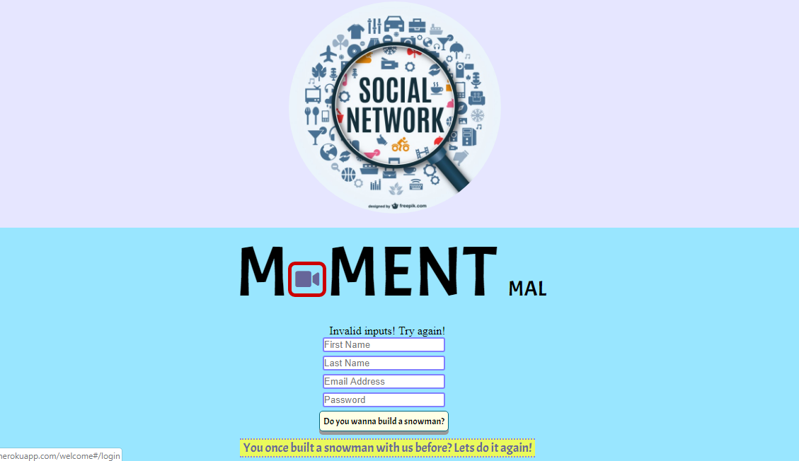
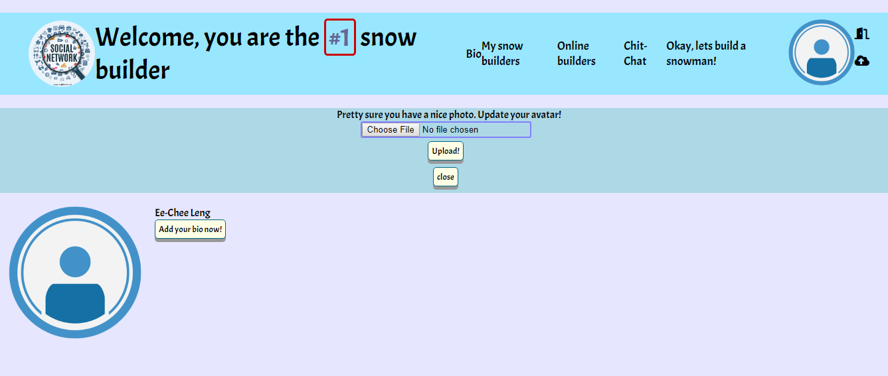

# SpicedAcademy-Tabasco-SocialNetwork
This is a social network which users can sign up, say a little about themselves, become friends with other users and even build a snowman together. This is also a single-page application made with React.js. Interesting? Register an account with your friends and have fun together: https://momentmal.herokuapp.com.

## Features
1) Registration
* When logged-out users arrive at the site, they should be redirected to a /welcome route that serves the same HTML file as / and it should show a UI that looks something like this:

* The page shows the social network's identity in a large display. A form with the fields: first name, last name, email and password. Also a button to submit the registration form.
* Two React components are required to create this display. A component called Registration that displays the registration form itself.
A component called Welcome that renders Registration as well as the surrounding UI. The form is made to be its own component so that there is an option of placing it in other contexts. 
* Registration is a stateful component. That is, it is created using class since it needs to have a state property that is updated in response to changes. For example, if the axios response to the POST triggered by clicking on the button indicates that something went wrong, an error message will be rendered.

2) Log-in 
* A new component called Login is required for this form. This component works pretty much like Registration. It submits user input via axios and redirect upon success. It also displays a message if an error occurs.
* The real challenge here is swapping out the Registration component for the Login component when the user clicks the link. It is accomplished by using React Router. React Router lets you specify in JSX what components should display when specific urls are navigated to. For this part of the project HashRouter is used.
* When users log-in successfully, a cookie is created and they are redirected to page with a new top-level component named App that containes Logo, user ID, avatar, log-out, profile picture(avatar) uploader and other components. 

3) Uploading avatar
* As soon as users log-in, App makes an axios request in the componentDidMount method to get basic data about the user such as id, first name, last name, and their avatarurl. Then, it passes the avatar url to Avatar component.
* Avatar displays the image. If there is no url, a default user image is displayed.
* The next child component of App, Uploader is only visible after the user clicks on the avatar. Its display is determined by a property of the state of the App component called uploaderVisible. Avatar is passed with a function from App. Upon clicking, event is triggered and the function is called to set this property to true making Uploader visible.
* The Uploader component is also passed a function for setting the avatarurl of the App component's state. After a successful upload, it calls this function and pass to it the url of the image that was just uploaded, causing Avatar to automatically switch to the new image. Finally, the function for setting avatarurl also sets uploaderVisible to false.

**_NOTES_**:
* Coding technologies: HTML, CSS, Javascript
Webpack, the tool we use to compile our code, will start with src/start.js. Any js file that start.js imports from (as well as the files that those files import from) will be included in the bundle. The js files you create and import should be placed in the src directory.
